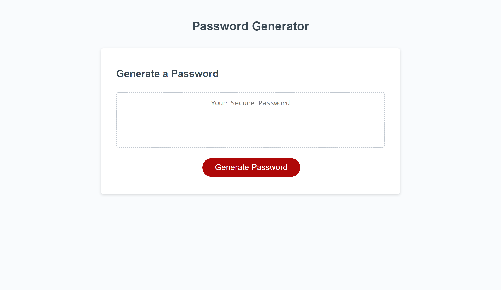

# Password Generator

## Description

This project created a secure password generator using the users preferences on password length, and characters to be included. Using existing HTML, CSS, and the beginning of the Javascript code, I fleshed out the Javascript to generate a random password from the variables selected by the user.  The link to the deployed site is below:

https://jennnmarshall.hithub.io/password-generator

## Installation

N/A

## Usage

This password generator is designed to generate secure, randomized passwords for use in user logins. Click the "generate password" button and fill in the prompts from your browser to generate a custom secure password.

## Credits

Starter code provided by bootcampspot.

## License

Please refer to the license in the repo.
